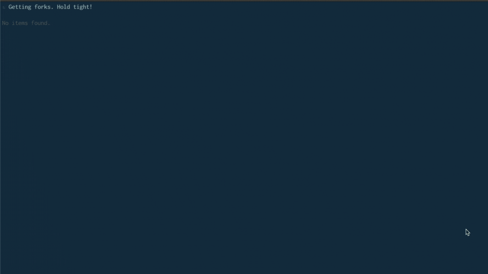

<h1 align="center">
    synrk
</h1>
<p align="center">
    <b>synrk</b> is a CLI tool that you can use to synchronize your forks with upstream repositories. You can select more than one repository at a time and synchronize them.<br>
    <i>[syn]</i>chronize Fo<i>[rk]</i>s
</p>

----


>[!warning]
> **`synrk` was previously known as `forky`**. The package has been renamed for clarity and future development. The codebase remains the same—only the name has changed.  
>  
> `forky` is now deprecated and will no longer receive updates.


## Demo
### Dark

### Light

## How does synrk work basically?
**synrk** detect the `default` branch(`main`, `master`, or `trunk` whatever it is) of your forked repository and will try to compare it with the upstream repository's `same-named` branch to find how many commits behind by your forked repositories are. Then it will show available forks which left behind the upstream repositories to synchronize.
## Installation
### Mac OS
```sh
brew install thetnaingtn/tap/synrk
```
### npm
Are you a Node.js developer or Node.js is installed on your system? Perfect! **synrk** also available as **npm** package
```sh
npx synrk@latest --token `your github token`
```

## Usage
```sh
synrk --token `your github token`
```
By default, forks that have been updated on the same day the command is run are excluded. To include these forks, use the -f flag.

```sh
synrk --token `your github token` -f
```
## Keymaps
You can use the following keys to interact with **synrk**
| Key              | Description                                 |
|:-----------------|:--------------------------------------------|
| <kbd>a</kbd>     | Select all forks                            |
| <kbd>n</kbd>     | Select none of the forks                    |
| <kbd>space</kbd> | Toggle(select/unselect) the fork            |
| <kbd>r</kbd>     | Refresh                                     |
| <kbd>m</kbd>     | Merge the selected fork with upstream branch|
| <kbd>q</kbd>     | Quit                                        |
